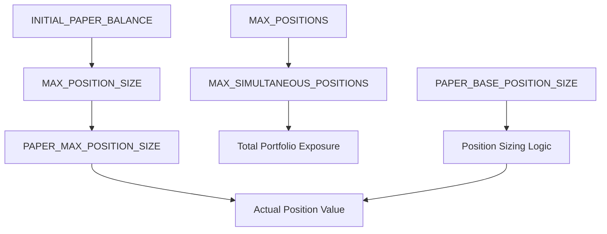
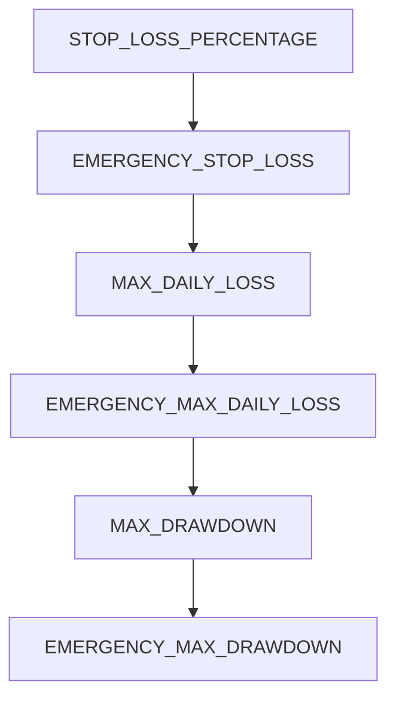
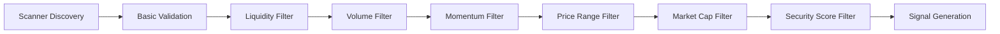
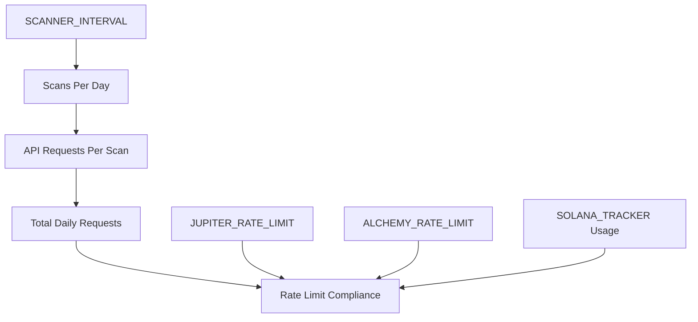

# 🔄 SolTrader Settings Interactions & Dependencies Guide

## 🎯 Overview

This guide maps how different settings in your SolTrader bot interact with each other, including dependencies, conflicts, validation chains, and performance impacts. Understanding these relationships is crucial for optimal configuration and avoiding system conflicts.

## 📋 Table of Contents

1. [🔗 Critical Setting Dependencies](#-critical-setting-dependencies)
2. [⚖️ Validation Chain Flow](#️-validation-chain-flow)
3. [⚠️ Common Conflicts & Solutions](#️-common-conflicts--solutions)
4. [📊 Performance Impact Chains](#-performance-impact-chains)
5. [🔄 Setting Hierarchies](#-setting-hierarchies)
6. [🎯 Optimization Strategies](#-optimization-strategies)
7. [🚨 Troubleshooting Matrix](#-troubleshooting-matrix)

---

## 🔗 Critical Setting Dependencies

### 1. **Position Management Chain**


#### **Dependencies:**
- `INITIAL_PAPER_BALANCE` × `MAX_POSITION_SIZE` = Maximum position in SOL
- `MAX_POSITIONS` must equal `MAX_SIMULTANEOUS_POSITIONS` (avoid conflicts)
- `PAPER_BASE_POSITION_SIZE` ≤ `PAPER_MAX_POSITION_SIZE`
- Total exposure = `MAX_POSITIONS` × `MAX_POSITION_SIZE`

#### **Critical Relationships:**
```env
# Example: Consistent Position Management
INITIAL_PAPER_BALANCE=100.0
MAX_POSITION_SIZE=0.2                    # 20% max position
PAPER_MAX_POSITION_SIZE=0.25             # 25% paper max (should be ≥ MAX_POSITION_SIZE)
MAX_POSITIONS=3                          # 3 positions
MAX_SIMULTANEOUS_POSITIONS=3             # Must match MAX_POSITIONS
# Result: Max exposure = 3 × 20% = 60% of balance
```

---

### 2. **Risk Management Hierarchy**


#### **Risk Escalation Chain:**
1. **Individual Position**: `STOP_LOSS_PERCENTAGE` (15%)
2. **Emergency Individual**: `EMERGENCY_STOP_LOSS` (20%)  
3. **Daily Portfolio**: `MAX_DAILY_LOSS` (1.0 SOL)
4. **Emergency Daily**: `EMERGENCY_MAX_DAILY_LOSS` (100.0 USD)
5. **Portfolio Drawdown**: `MAX_DRAWDOWN` (5.0%)
6. **Emergency Drawdown**: `EMERGENCY_MAX_DRAWDOWN` (10.0%)

#### **Validation Rules:**
```env
# Risk hierarchy must be maintained
STOP_LOSS_PERCENTAGE < EMERGENCY_STOP_LOSS
MAX_DAILY_LOSS < EMERGENCY_MAX_DAILY_LOSS (in equivalent units)
MAX_DRAWDOWN < EMERGENCY_MAX_DRAWDOWN
```

---

### 3. **Token Filtering Pipeline**


#### **Filter Chain Dependencies:**
1. **Scanner Level**: `PAPER_MIN_LIQUIDITY`, `PAPER_MIN_MOMENTUM_THRESHOLD`
2. **Strategy Level**: `MIN_LIQUIDITY`, `MIN_VOLUME_24H`
3. **Signal Level**: `PAPER_SIGNAL_THRESHOLD`

#### **Cascading Effects:**
```env
# Restrictive Chain Example (Results in ~5% approval rate)
PAPER_MIN_LIQUIDITY=2000.0               # High barrier
MIN_VOLUME_24H=500.0                     # High barrier  
PAPER_MIN_MOMENTUM_THRESHOLD=10.0        # High barrier
PAPER_SIGNAL_THRESHOLD=0.8               # High barrier
# Result: Very few tokens pass all filters

# Permissive Chain Example (Results in ~60% approval rate)
PAPER_MIN_LIQUIDITY=50.0                 # Low barrier
MIN_VOLUME_24H=25.0                      # Low barrier
PAPER_MIN_MOMENTUM_THRESHOLD=2.0         # Low barrier
PAPER_SIGNAL_THRESHOLD=0.2               # Low barrier
# Result: Many tokens pass filters
```

---

### 4. **API Rate Limiting Chain**


#### **API Usage Calculation:**
```
Daily Scans = 86400 seconds ÷ SCANNER_INTERVAL
Requests Per Scan = ~10-50 (varies by API strategy)
Total Daily Requests = Daily Scans × Requests Per Scan

# Example:
SCANNER_INTERVAL = 900 (15 minutes)
Daily Scans = 86400 ÷ 900 = 96 scans/day
If 20 requests per scan = 1920 total requests/day
```

#### **Quota Management Dependencies:**
- **Solana Tracker**: 333 requests/day limit → `SCANNER_INTERVAL` ≥ 260 seconds
- **GeckoTerminal**: ~30,000 requests/day → More permissive
- **Dual API**: Balanced between both → Optimized intervals

---

## ⚖️ Validation Chain Flow

### 📍 **Token Discovery to Execution Pipeline**

#### **Stage 1: Scanner Discovery**
```env
# Scanner-level filters (src/enhanced_token_scanner.py)
min_liquidity = 100.0                    # From scanner settings
min_momentum_percentage = 5.0            # From scanner settings
max_token_age_hours = 24                 # From scanner settings
```

#### **Stage 2: Strategy Validation**
```env
# Strategy-level filters (src/trading/strategy.py)
MIN_LIQUIDITY (from .env)                # Must pass this filter
MIN_VOLUME_24H (from .env)               # Must pass this filter
MIN_TOKEN_PRICE_SOL (from .env)          # Price range validation
MAX_TOKEN_PRICE_SOL (from .env)          # Price range validation
MIN_MARKET_CAP_SOL (from .env)           # Market cap validation
MAX_MARKET_CAP_SOL (from .env)           # Market cap validation
```

#### **Stage 3: Signal Generation**
```env
# Signal quality thresholds
PAPER_SIGNAL_THRESHOLD                   # Minimum signal strength
ML_CONFIDENCE_THRESHOLD                  # ML model confidence (if enabled)
```

#### **Stage 4: Risk Validation**
```env
# Position sizing validation
MAX_POSITION_SIZE                        # Position size limit
PAPER_MAX_POSITION_SIZE                  # Paper-specific limit
current_balance >= MIN_BALANCE           # Balance validation
```

#### **Stage 5: Execution Validation**
```env
# Pre-execution checks
MAX_POSITIONS                            # Position count limit
MAX_DAILY_TRADES                         # Daily trade limit
MAX_SLIPPAGE                             # Slippage tolerance
```

### 🔄 **Validation Flow Logic**
```python
# Pseudo-code for validation chain
def validate_token_for_trading(token):
    # Stage 1: Scanner filters (already applied)
    
    # Stage 2: Strategy validation
    if token.liquidity < settings.MIN_LIQUIDITY:
        return False, "liquidity"
    if token.volume_24h < settings.MIN_VOLUME_24H:
        return False, "volume" 
    if not (settings.MIN_TOKEN_PRICE_SOL <= token.price <= settings.MAX_TOKEN_PRICE_SOL):
        return False, "price_range"
    if not (settings.MIN_MARKET_CAP_SOL <= token.market_cap <= settings.MAX_MARKET_CAP_SOL):
        return False, "market_cap_range"
    
    # Stage 3: Signal validation
    signal = generate_signal(token)
    if signal.strength < settings.PAPER_SIGNAL_THRESHOLD:
        return False, "signal_strength"
    
    # Stage 4: Risk validation
    position_size = calculate_position_size(signal)
    if position_size > settings.MAX_POSITION_SIZE * balance:
        return False, "position_size"
    
    # Stage 5: Execution validation
    if current_positions >= settings.MAX_POSITIONS:
        return False, "max_positions"
    if daily_trades >= settings.MAX_TRADES_PER_DAY:
        return False, "daily_limit"
    
    return True, "approved"
```

---

## ⚠️ Common Conflicts & Solutions

### 1. **Position Limit Mismatch**
```env
# ❌ CONFLICT
MAX_POSITIONS=3
MAX_SIMULTANEOUS_POSITIONS=5             # Mismatch causes confusion

# ✅ SOLUTION
MAX_POSITIONS=3
MAX_SIMULTANEOUS_POSITIONS=3             # Must be equal
```

### 2. **Risk Hierarchy Inversion**
```env
# ❌ CONFLICT  
STOP_LOSS_PERCENTAGE=0.25                # 25% stop loss
EMERGENCY_STOP_LOSS=0.15                 # 15% emergency (should be higher)

# ✅ SOLUTION
STOP_LOSS_PERCENTAGE=0.15                # 15% regular stop
EMERGENCY_STOP_LOSS=0.25                 # 25% emergency stop
```

### 3. **Over-Restrictive Filtering**
```env
# ❌ CONFLICT (Results in 0% approval rate)
PAPER_MIN_LIQUIDITY=5000.0               # Very high requirement
MIN_VOLUME_24H=2000.0                    # Very high requirement
PAPER_MIN_MOMENTUM_THRESHOLD=20.0        # Very high requirement
PAPER_SIGNAL_THRESHOLD=0.9               # Very high requirement

# ✅ SOLUTION (Balance requirements)
PAPER_MIN_LIQUIDITY=500.0                # Moderate requirement
MIN_VOLUME_24H=150.0                     # Moderate requirement
PAPER_MIN_MOMENTUM_THRESHOLD=5.0         # Moderate requirement
PAPER_SIGNAL_THRESHOLD=0.5               # Moderate requirement
```

### 4. **API Quota Exhaustion**
```env
# ❌ CONFLICT
SCANNER_INTERVAL=60                      # 1-minute scans
# With Solana Tracker (333 req/day limit) = 1440 scans/day × 5 req/scan = 7200 requests/day (OVER LIMIT)

# ✅ SOLUTION
SCANNER_INTERVAL=900                     # 15-minute scans
# Results in: 96 scans/day × 5 req/scan = 480 requests/day (UNDER LIMIT)
```

### 5. **Inconsistent Paper vs Live Settings**
```env
# ❌ CONFLICT
PAPER_MIN_LIQUIDITY=50.0                 # Very permissive for paper
MIN_LIQUIDITY=2000.0                     # Very restrictive for live
# This causes different behavior between paper and live modes

# ✅ SOLUTION (Aligned thresholds)
PAPER_MIN_LIQUIDITY=250.0                # Moderate for paper
MIN_LIQUIDITY=500.0                      # Slightly higher for live (logical progression)
```

---

## 📊 Performance Impact Chains

### 1. **Trading Frequency Chain**
```
SCANNER_INTERVAL ↓ → More Scans → More Opportunities
PAPER_SIGNAL_THRESHOLD ↓ → More Signals → More Trades  
MAX_POSITIONS ↑ → More Simultaneous Trades
MAX_TRADES_PER_DAY ↑ → Higher Daily Volume
```

**Optimization Example:**
```env
# High-Frequency Configuration
SCANNER_INTERVAL=300                     # 5-minute scans
PAPER_SIGNAL_THRESHOLD=0.2               # Low threshold
MAX_POSITIONS=5                          # More positions
MAX_TRADES_PER_DAY=25                    # High daily limit
# Result: 15-25 trades per day
```

### 2. **Risk-Reward Chain**
```
STOP_LOSS_PERCENTAGE ↓ → Lower Risk Per Trade
TAKE_PROFIT_PERCENTAGE ↑ → Higher Reward Per Trade
MAX_POSITION_SIZE ↑ → Higher Absolute Risk/Reward
```

**Conservative Example:**
```env
STOP_LOSS_PERCENTAGE=0.08                # 8% risk
TAKE_PROFIT_PERCENTAGE=0.15              # 15% reward
MAX_POSITION_SIZE=0.1                    # 10% position
# Risk-Reward Ratio: 1:1.875 (good)
# Max Risk Per Trade: 0.8% of balance
```

**Aggressive Example:**
```env
STOP_LOSS_PERCENTAGE=0.20                # 20% risk
TAKE_PROFIT_PERCENTAGE=1.0               # 100% reward
MAX_POSITION_SIZE=0.3                    # 30% position
# Risk-Reward Ratio: 1:5 (excellent) 
# Max Risk Per Trade: 6% of balance (high)
```

### 3. **Quality vs Quantity Chain**
```
MIN_LIQUIDITY ↑ → Fewer But Higher Quality Tokens
PAPER_MIN_MOMENTUM_THRESHOLD ↑ → Stronger Signals Required
MIN_TRENDING_SCORE ↑ → Only Top Trending Tokens
Result: Lower Approval Rate, Higher Win Rate
```

---

## 🔄 Setting Hierarchies

### 1. **Position Size Hierarchy**
```
Portfolio Level:
├── INITIAL_PAPER_BALANCE (100.0 SOL)
├── MAX_PORTFOLIO_RISK (10.0%) = 10 SOL max total risk
│
Position Level:
├── MAX_POSITION_SIZE (0.2) = 20 SOL max per position
├── PAPER_MAX_POSITION_SIZE (0.25) = 25 SOL max paper position
├── STOP_LOSS_PERCENTAGE (0.15) = 15% max loss per position
│
Result: Max risk per position = 25 × 0.15 = 3.75 SOL
Total positions: 3 × 3.75 = 11.25 SOL potential loss (exceeds portfolio risk!)
```

**Balanced Hierarchy:**
```env
# Ensure hierarchy consistency
INITIAL_PAPER_BALANCE=100.0
MAX_PORTFOLIO_RISK=0.06                  # 6% = 6 SOL max risk
MAX_POSITION_SIZE=0.15                   # 15 SOL max position
STOP_LOSS_PERCENTAGE=0.12                # 12% stop loss
MAX_POSITIONS=3
# Max risk per position: 15 × 0.12 = 1.8 SOL
# Total max risk: 3 × 1.8 = 5.4 SOL (within 6 SOL limit) ✅
```

### 2. **Filter Strictness Hierarchy**
```
Most Permissive → Most Restrictive:

Scanner Level (src/enhanced_token_scanner.py):
├── min_liquidity = 100.0 SOL
├── min_momentum_percentage = 5.0%

Strategy Level (src/trading/strategy.py):
├── MIN_LIQUIDITY = 250.0 SOL (stricter)
├── MIN_VOLUME_24H = 50.0 SOL
├── Price/Market Cap ranges

Signal Level:
├── PAPER_SIGNAL_THRESHOLD = 0.3
├── ML_CONFIDENCE_THRESHOLD = 0.7 (if enabled)
```

### 3. **API Usage Hierarchy**
```
Primary APIs (High Priority):
├── Alchemy RPC (blockchain data)
├── Jupiter (price/swap data)

Secondary APIs (Medium Priority):
├── Solana Tracker (token discovery)
├── GeckoTerminal (market data)

Tertiary APIs (Low Priority):
├── Birdeye (trending data)
├── ML Services (predictions)
```

---

## 🎯 Optimization Strategies

### 1. **Balanced Optimization Approach**
```env
# Step 1: Start with balanced baseline
PAPER_SIGNAL_THRESHOLD=0.5
PAPER_MIN_LIQUIDITY=500.0
MAX_POSITION_SIZE=0.15
STOP_LOSS_PERCENTAGE=0.12
TAKE_PROFIT_PERCENTAGE=0.25

# Step 2: Monitor for 48 hours
# - If too few trades (< 3/day): Lower thresholds by 20%
# - If too many bad trades (< 60% win rate): Raise thresholds by 20%
# - If excessive risk: Reduce position sizes by 25%

# Step 3: Iterate based on performance
```

### 2. **Risk-First Optimization**
```env
# Step 1: Set risk limits first
MAX_DAILY_LOSS=1.0                       # Maximum 1 SOL daily loss
MAX_DRAWDOWN=5.0                         # Maximum 5% drawdown
MAX_POSITION_SIZE=0.1                    # Conservative 10% positions

# Step 2: Optimize for opportunities within risk constraints
PAPER_SIGNAL_THRESHOLD=0.3               # Start moderate
# Monitor: If risk too high, reduce position size before changing threshold
```

### 3. **Opportunity-First Optimization**
```env
# Step 1: Set aggressive discovery parameters
PAPER_MIN_LIQUIDITY=50.0                 # Very permissive
PAPER_SIGNAL_THRESHOLD=0.2               # Low threshold
SCANNER_INTERVAL=300                     # Frequent scans

# Step 2: Add risk controls to contain the opportunities
STOP_LOSS_PERCENTAGE=0.10                # Tight stops
MAX_POSITION_SIZE=0.08                   # Small positions
# Result: Many small, quick trades
```

---

## 🚨 Troubleshooting Matrix

### Problem: Zero Trades Executing
```
Diagnosis Chain:
1. Check scanner discovery: Are tokens being found?
2. Check strategy validation: Are tokens passing filters?
3. Check signal generation: Are signals being created?
4. Check risk validation: Are positions within limits?
5. Check execution logic: Are orders being processed?

Common Causes & Solutions:
├── Scanner not finding tokens
│   └── Solution: Lower PAPER_MIN_LIQUIDITY, increase MAX_TOKEN_AGE_HOURS
├── Strategy validation too strict  
│   └── Solution: Lower MIN_LIQUIDITY, MIN_VOLUME_24H
├── Signal threshold too high
│   └── Solution: Lower PAPER_SIGNAL_THRESHOLD
├── Position limits reached
│   └── Solution: Check MAX_POSITIONS, increase if needed
└── Balance insufficient
    └── Solution: Check INITIAL_PAPER_BALANCE, increase if needed
```

### Problem: Too Many Bad Trades
```
Diagnosis Chain:
1. Check win rate: < 50% indicates quality issue
2. Check average hold time: Too short may indicate poor entries
3. Check stop loss frequency: High stops = poor quality or tight stops
4. Check market conditions: Bear market affects all strategies

Solutions by Root Cause:
├── Poor signal quality
│   └── Increase PAPER_SIGNAL_THRESHOLD, MIN_TRENDING_SCORE
├── Poor entry timing
│   └── Add MIN_SIGNAL_INTERVAL, increase momentum requirements
├── Stops too tight
│   └── Increase STOP_LOSS_PERCENTAGE (but monitor risk)
└── Market conditions
    └── Reduce position sizes, tighten quality filters
```

### Problem: API Rate Limits Hit
```
Diagnosis:
Check logs for "rate limit" or "quota exceeded" errors

Solutions by API:
├── Solana Tracker (333 req/day limit)
│   └── Increase SCANNER_INTERVAL to 900+ seconds
├── Alchemy (tier-dependent)
│   └── Reduce ALCHEMY_RATE_LIMIT, optimize RPC calls
├── Jupiter (generous limits)
│   └── Usually not the issue, check implementation
└── GeckoTerminal (30K+ req/day)
    └── Usually not the issue unless misconfigured
```

### Problem: Inconsistent Performance
```
Diagnosis Areas:
├── Market condition changes
├── Setting conflicts  
├── API reliability issues
└── Balance/position sizing drift

Stabilization Strategy:
1. Lock core settings for 1 week
2. Monitor daily performance metrics
3. Identify patterns in good vs bad days
4. Adjust gradually based on data
```

---

## 📋 Configuration Validation Checklist

### ✅ **Pre-Deployment Validation**

#### Position Management
- [ ] `MAX_POSITIONS` = `MAX_SIMULTANEOUS_POSITIONS`
- [ ] `PAPER_BASE_POSITION_SIZE` ≤ `PAPER_MAX_POSITION_SIZE`
- [ ] `MAX_POSITION_SIZE` ≤ `PAPER_MAX_POSITION_SIZE`
- [ ] Total position exposure ≤ 80% of balance

#### Risk Hierarchy
- [ ] `STOP_LOSS_PERCENTAGE` < `EMERGENCY_STOP_LOSS`
- [ ] `MAX_DAILY_LOSS` < `EMERGENCY_MAX_DAILY_LOSS`
- [ ] `MAX_DRAWDOWN` < `EMERGENCY_MAX_DRAWDOWN`
- [ ] Individual position risk ≤ Portfolio risk tolerance

#### Filter Consistency
- [ ] Scanner filters ≤ Strategy filters (more permissive)
- [ ] Paper thresholds ≤ Live thresholds (paper more permissive)
- [ ] API usage within quota limits
- [ ] All percentage values between 0-1 for decimals

#### Performance Targets
- [ ] Expected trades/day aligns with `MAX_TRADES_PER_DAY`
- [ ] API requests/day < Daily quota limits
- [ ] Maximum portfolio exposure comfortable for risk tolerance
- [ ] Stop loss / Take profit ratio sensible (typically 1:1.5 to 1:3)

---

## 🎯 Advanced Optimization Techniques

### 1. **Dynamic Threshold Adjustment**
```python
# Pseudo-code for adaptive thresholds
def adjust_thresholds_based_on_performance():
    if daily_trades < 3:
        # Too few trades - loosen filters
        PAPER_SIGNAL_THRESHOLD *= 0.9
        PAPER_MIN_LIQUIDITY *= 0.9
    elif win_rate < 0.5:
        # Too many bad trades - tighten filters
        PAPER_SIGNAL_THRESHOLD *= 1.1
        MIN_TRENDING_SCORE *= 1.1
    elif drawdown > MAX_DRAWDOWN * 0.8:
        # Approaching risk limit - reduce exposure
        MAX_POSITION_SIZE *= 0.9
```

### 2. **Market Regime Adaptation**
```env
# Bull Market Settings (Higher risk tolerance)
MAX_POSITION_SIZE=0.25
TAKE_PROFIT_PERCENTAGE=0.6
STOP_LOSS_PERCENTAGE=0.18

# Bear Market Settings (Lower risk tolerance) 
MAX_POSITION_SIZE=0.1
TAKE_PROFIT_PERCENTAGE=0.2
STOP_LOSS_PERCENTAGE=0.10

# Sideways Market Settings (Balanced)
MAX_POSITION_SIZE=0.15
TAKE_PROFIT_PERCENTAGE=0.3
STOP_LOSS_PERCENTAGE=0.12
```

### 3. **Performance-Based Position Sizing**
```python
# Dynamic position sizing based on recent performance
if recent_win_rate > 0.7:
    # Increase position sizes for good performance
    position_multiplier = 1.2
elif recent_win_rate < 0.4:
    # Decrease position sizes for poor performance
    position_multiplier = 0.7
else:
    position_multiplier = 1.0

actual_position_size = base_position_size * position_multiplier
```

This comprehensive interactions guide should help you understand how every setting affects every other setting, enabling you to create optimally balanced configurations that avoid conflicts and maximize performance.